# CircleCI integration
Micro.Starter is using travis-ci for it's powerful build pipelines to ensure each change works as intended.

The following visualization will help understanding build flow better moving forward:

```mermaidjs
graph LR
B(Git Push) --> C(Unit tests)
B --> D(Build Packages)
B --> E(build docker, execute and push to docker hub)
C --> H
D --> H
E --> H(tag, push and create a Github release)
```


## Preparation Phase
First step is to pull docker image. This way it's always in local cache

## Test Stage

Test has 3 tasks, being `unit tests`, `build package` and `postman tests` since there's no reason for tests
to wait for build to finish, they execute in parallel which seen on screenshot

Postman tests first builds a docker image, runs the tests and finally build the docker image and pushes to docker hub

### Deploy Stage

This step simply tags the docker image, pushes the tag to docker hub, and creates a github release, also comments on PR and issues related to this release if any.
For all these automation, it uses semantic-release, please look into release automation section of documentation

```bash
docker run fossapps/micro.starter:tag
```
Where tag can be either `latest` or any github tag (or the short commit hash)

Please note that length short commit hash might change if ambiguity arises (this happens when project grows more)

To find exact tag, you can see circle ci build and find tag that way,
or if you know a commit was built (if a push included multiple commits, only last commit will be built)
then you can simply search for tag with matching hash.
